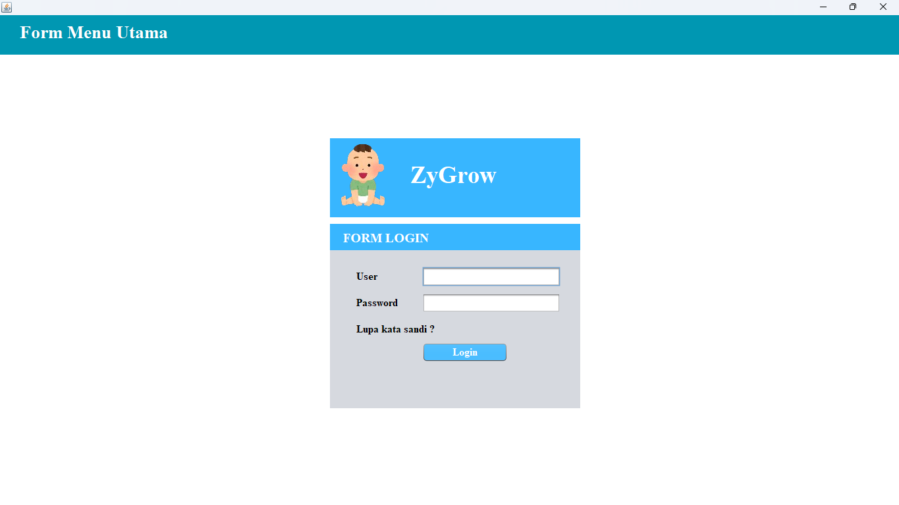
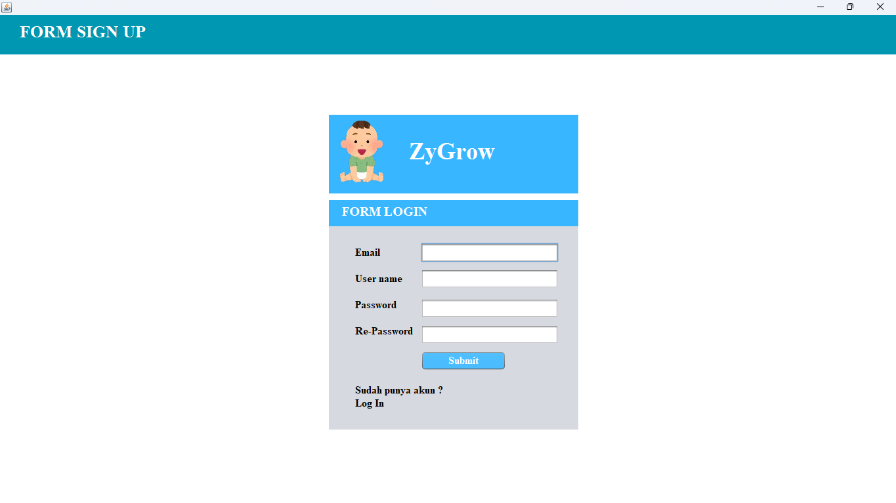
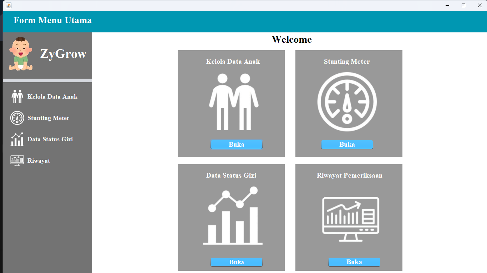

<h1 align="center">ZyGrow</h1>

<b>Sistem Informasi Pencatatan Data Antropometri dan Status Gizi Anak Berbasis Desktop</b>

  
  
  
  

---

## 📥 Download Aplikasi

### 🔹 Download Installer (EXE)
👉 https://www.mediafire.com/file/i69k38w3zm1eouh/Zygrow-1.0.0.rar/file

### 🔹 Download Database
👉 https://www.mediafire.com/file/m36dbn0xvlpzi8k/db_stunting.sql/file

> 📌 **Catatan:**  
> - Project source code **belum dipublikasikan**  
> - Pastikan database sudah di-import sebelum menjalankan aplikasi

---

## 📖 Tentang ZyGrow
**ZyGrow** adalah aplikasi desktop yang dirancang untuk membantu pencatatan, analisis, dan pengolahan data **antropometri anak** menggunakan standar **Z-Score WHO**.

Aplikasi ini mendukung kader posyandu:
- 📊 Monitoring pertumbuhan anak  
- 📝 Pencatatan rutin data kesehatan  
- ⚕️ Evaluasi status gizi secara cepat, akurat, dan terstruktur  

Data antropometri yang dikelola meliputi:
- Nama
- Umur
- Berat Badan (BB)
- Tinggi/Panjang Badan (TB/PB)
- Lingkar Kepala (LK)

---

## ✨ Fitur Utama

### 🔐 1. Sistem Login Pengguna
Mengamankan akses aplikasi sesuai pengguna yang terdaftar.

### 👶 2. Manajemen Data Anak (CRUD)
Mengelola data identitas anak, riwayat pengukuran, dan informasi pendukung lainnya.

### 📏 3. Perhitungan Status Gizi WHO
Menggunakan standar Z-Score WHO:
- BB/U  
- TB/U  
- BB/TB  

### 📈 4. Grafik Perkembangan
Visualisasi pertumbuhan anak menggunakan grafik interaktif (JFreeChart).

### 🗄 5. Sistem Database
Integrasi database **MySQL / SQLite** untuk penyimpanan data yang stabil.

### 📤 6. Export Laporan
Menyediakan laporan data dan hasil analisis dalam format yang mudah dibaca.

### 🎨 7. Antarmuka GUI Modern
Desain antarmuka menggunakan **Java Swing** dan GUI Builder NetBeans.

---

## 🛠 Teknologi yang Digunakan

| Komponen | Teknologi |
|--------|-----------|
| 💻 Bahasa | Java |
| 🖼 GUI | Java Swing / NetBeans GUI Builder |
| 🗄 Database | MySQL / SQLite |
| 📊 Grafik | JFreeChart |
| 📐 Standar Gizi | WHO Anthro (Z-Score) |
| ⚙️ IDE | Apache NetBeans / IntelliJ IDEA |

---

## 📸 Tampilan Aplikasi ZyGrow

### 🔐 Halaman Login

### 📝 Halaman Pendaftaran (Signup)

### 🏠 Dashboard Utama

---

## ⚙️ Cara Instalasi ZyGrow

### 🧩 Persiapan Sistem
- 💻 Windows 10 / 11 (64-bit)
- ☕ Java Runtime sudah termasuk di aplikasi
- 🗄 MySQL / MariaDB
- 📦 WinRAR / 7-Zip

---

### 📥 1. Download File
- Installer Aplikasi:  
  https://www.mediafire.com/file/6a3hodwzj5baop2/Zygrow-1.0.0.rar/file
- Database:  
  https://www.mediafire.com/file/m36dbn0xvlpzi8k/db_stunting.sql/file

---

### 📦 2. Ekstrak Aplikasi
1. Klik kanan `Zygrow-1.0.0.rar`
2. Pilih **Extract Here** atau **Extract to Zygrow-1.0.0/**
3. Pastikan file **ZyGrow.exe** ada di folder hasil ekstraksi

---

### 🗄 3. Import Database
1. Jalankan MySQL / XAMPP
2. Buka **phpMyAdmin**
3. Buat database baru:
db_stunting
4. Pilih database → **Import**
5. Pilih file `db_stunting.sql`
6. Klik **Go**

---

### 🔧 4. Konfigurasi Database
Sesuaikan konfigurasi koneksi database:
host = localhost
port = 3306
database = db_stunting
username = root
password =

---

### ▶️ 5. Menjalankan Aplikasi
1. Double click **ZyGrow.exe**
2. Tunggu hingga aplikasi terbuka
3. Halaman login akan muncul

---

### 🔐 6. Login Aplikasi
Gunakan akun default:
Username : admin
Password : admin

---

### ✅ 7. Selesai
Aplikasi siap digunakan untuk:
- Input data anak
- Analisis status gizi
- Grafik pertumbuhan
- Manajemen data terstruktur

---

## 📌 Catatan Tambahan
- Aplikasi berjalan **offline**
- Cocok untuk **Posyandu, Puskesmas, dan Edukasi**
- Data tersimpan di database lokal
